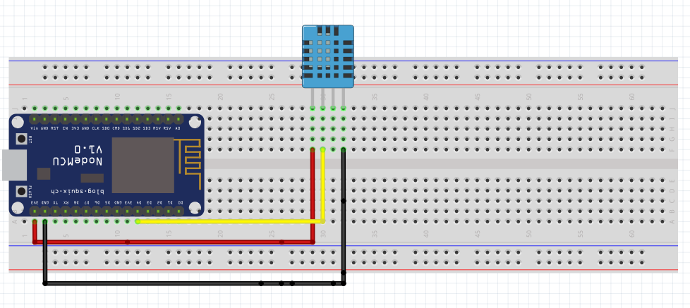
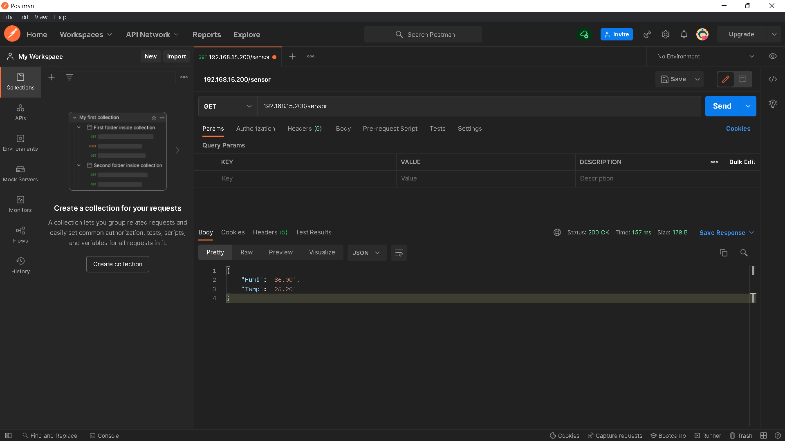

# API-ESP8266

### Nesse arquivo teremos o passo a passo de como montar o circuito, realizar as configurações de conexão com a rede, envio do código para placa e realizar um teste com a API, e configuração para cominucação com o banco MySQL.
___

# Sumário

* [Sobre](#Sobre)
* [Componentes](#Componentes)
* [Esquemático](#Esquemático)
* [Softwares](#Softwares)
* [Como utilizar](#Como-utilizar)
    * [Arquivo config](#Arquivo-config)
    * [Barra de ferramentas PlatformIO](#Barra-de-ferramentas-PlatformIO)
* [Postman](#Postman)
* [MySQL](#MySQL)
* [Utilizando em um cenario real](#Utilizando-em-um-cenario-rea)
___
# Sobre
<p> O objetivo desse projeto é criar uma API com o ESP8266, com o intuito de realizar o monitoramento de temperatura e umidade utilizando o sensor DHT11 e armazenar essas informações em um banco de dados MySQL.</p>

# Componentes
+ ESP8266;
+ DHT11;
+ Jumpers;
+ Servidor MySQL;

# Esquemático

<div align="center">

</div>

# Softwares
+ Visual Studio Code;
+ PlatformIO;
+ MySQL Workbench;

# Como utilizar

+ Baixe o projeto em sua máquina;
+ Abra o projeto com o vscode utilizando a extensão <b>PlatformIO</b>;
+ Abra a pasta <b>src</b>, nessa pasta terá três arquivos, abra o arquivo <b>Config.h</b>;

## Arquivo-config

+ <p> Preencha os campos para realizar a configuração de rede para o ESP8266 </p>

```c++

1   /***    Configuração de rede    ****/
2
3   const char* ssid = "";          //Nome da sua rede Wi-Fi
4   
5   const char* password = "";      //Senha da rede Wi-Fi
6   
8   IPAddress ip(x, x, x, x);       //IP para o ESP8266
9   
10  IPAddress subnet(x, x, x, x);   //Mascara da rede
11  
12  IPAddress gateway(x, x, x, x);  //Gateway da rede
13
14  char name[] = "lolin";          //Nome para acesso do Esp8266
15
16  /**********************************/
17
18  /***    Configuração SQL    ****/
19
20  IPAddress serverSQL(x, x, x, x); //IP do servidor mySQL
21  
22  #define port 3306               //Porta do banco mySQL
23
24  char user[] = "";               //Usuario do banco
25  
26  char pass[] = "";               //Senha do usuario
27  
28  char INSERT_SQL[] = "
INSERT INTO dbesp8266.dht11 (humi, temp, day_register, hour_register) 
VALUES 
(%s, %s, CURDATE(), CURTIME())
";                         //Query para realizar o insert no banco
29
30  /**********************************/
31
33  /***    Configuração DHT11     ****/
33
34  #define DHTPIN D4       //Pino do DHT11 conectado no ESP8266
35
36  #define DHTTYPE DHT11   //Definimos que o sensor utilizado é o DHT11
37
38  /**********************************/
49
40  unsigned long insertInterval = 300000;  //Intervalo que o insert sera executado
```

+ Em seguida iremos utilizar a barra de ferramentas do PlatformIO para enviar o código para a placa;
+ Após o envio ser finalizado, abra o Serial monitor e verá se o ESP conectou com sucesso na rede;

## Barra-de-ferramentas-PlatformIO

<div align="center">


</div>

1-Home

2-Compilar

3-Upload

4-Clean

5-Serial monitor

6-PlatformIO Core (CLI)

7-Alterar o projeto
___

# Postman

<p>Após realizar os passos anteriores, iremos realizar um teste em nossa API, para verificar se o mesmo esta funcionando, abra o seu Postman e realize um teste, coloque o seguite endereço: 
<b>ip/sensor</b> ou <b>lolin.local/sensor</b>

OBS: Mesmo endereço configurado no codigo.

</p>



###
___

# MySQL

<p>Nesse exemplo o insert no banco esta sendo realizado a cada 5 minutos, para alterar esse tempo basta colocra um valor em <b>milisegundos</b> na variavel <b>insertInterval</b> localizado no arquivo <b>Config.h</b>.

```sql

    SELECT id, humi as 'Umidade %', temp as 'Temperatura C°',
    day_register as 'Data', hour_register as 'Horas'
    FROM dht11 
    LIMIT 5;

	id	Umidade %	Temperatura C°	Data	Horas
	1	76.0	28.1	2022-04-24	13:06:18
	2	75.0	27.9	2022-04-24	13:11:18
	3	75.0	27.9	2022-04-24	13:16:18
	4	75.0	27.8	2022-04-24	13:21:19
	5	75.0	27.8	2022-04-24	13:26:18
```

### 
___

# Utilizando em um cenario real

<p>Você pode usar o projeto <a href="https://github.com/viniciosAnhas/Front-ESP8266" target="_blank"> Front-ESP8266</a> como exemplo para apresentação dos dados em tempo real.</p>

###
___

 <div align="center">

<p>Estou disponível para tirar qualquer dúvida do projeto 👍</p>

   <a href="https://www.linkedin.com/in/vinicios-moraes-anhas-199478160/" target="_blank">  </a> 
   
</div>